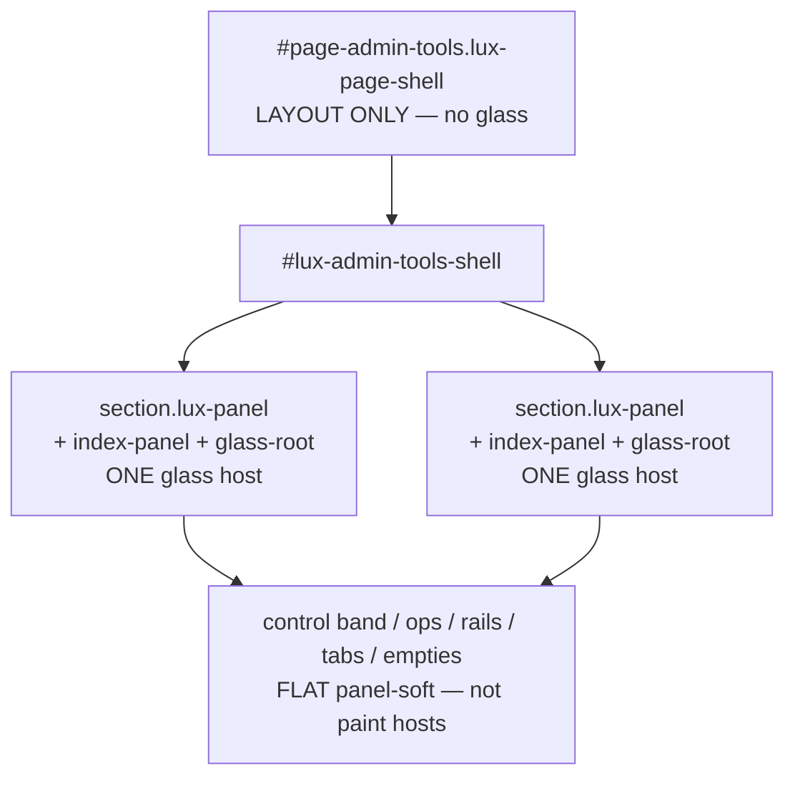

# Admin-tools visual perfection — handoff

**Audience:** Next agent (Antigravity / stronger model) continuing this work.  
**Route:** `admin-tools.html` — Curriculum Library + Registration Setup (WORKS hub).  
**Date context:** 2026-07-24.  
**Do not revive** `admin-tools-luxury.css` (~5.5k lines deleted). Port minimal layout into the bare stack only.

---

## 1. What we are trying to achieve

Make **admin-tools** look like a finished luxury workspace that matches the **dashboard / staff hub** design system:

| Goal | Meaning |
|------|---------|
| **One glass host per section** | Outer Curriculum / Registration cards are frosted panels. Nested chrome (ops tiles, control band, tabs, empty states, program list) is **flat soft inset** — no second blur/frame. |
| **No peel / double sticker** | No outer `#page-admin-tools.lux-page-shell` glass + inner `.lux-panel` glass stacking. No white L-shaped button edges. |
| **Readable controls** | Dark search/select fields, in-field search icon, head rows with title left / actions right, program list + pane as a real 2-column layout. |
| **Clean dense CTAs** | 12px radius, 1px border, no asymmetric pill / thick frame / always-on `::before` sheen under `#lux-admin-tools-shell`. |
| **Engine vs CSS agreement** | Transparency (`lux-transparency.js`) must not re-apply `!important` blur/fill that defeats CSS demotion. |

**Out of scope unless explicitly expanded:** global `--lux-btn-pill-radius` site-wide, LMS/social/other routes, wave-2 domain peels (`admin-reg-*` deep redesign, subject builder `social-neo-*` buttons, inner curriculum library recipe overhaul).

---

## 2. Design-system rules (do not break)

- Bare portals use: `lux-page-bare` + `lux-full-paint` + FOUC + bare-lite + tokens/controls/shell.
- Glass SSOT: `--lux-panel-*` / `--lux-elev-*` in `assets/css/lux-tokens.css` — not per-route `--*-fade-*` literals.
- Soft-chrome alone = matte; blur glass needs `.lux-panel` / `.page-hero` under `body.lux-unified-shell`.
- Staff pattern: soft-chrome on **outer shell + one control band**, not every metric tile.
- Guards: `npm run check:panels`. Prefer Vitest:  
  `test/admin-tools-route-regressions.test.js`, `test/phase-a-css-stack-guard.test.js`.

---

## 3. Journey so far (why it still feels unfinished)

```text
Wave 1 redesign
  → lux-modals + soft-chrome on bands/tiles
  → pink wash (nested soft-chrome → --home-fade-soft faculty accent)

Visual repair
  → strip nested soft-chrome; restore grids in bare-lite
  → still double glass + peeled CTAs + white search

Glass polish
  → CSS demote page-shell; flatten some sheen; soften ops
  → transparency engine still re-frosted page-shell with inline !important

Grok “perfection” plan (interrupted) + Cursor continue
  → narrow keep/host lists; stop subpanel stamp; CTA 12px; search/layout port
  → still not “perfect” in browser: residual stamps, cascade fights, incomplete chrome
```

**Root conflict:** CSS says “page-shell is transparent”; transparency JS used to say “blur every `.lux-page-shell`”. Partial fixes landed; visual QA still fails some smoke items.

---

## 4. Architecture (current intended model)



**Markup owners**

| Piece | File |
|-------|------|
| Shell / decks / control band / ops tiles | `assets/js/features/index-admin-tools.plain.js` (+ `bundle-source.js`; loader `index-admin-tools.js`) |
| Curriculum workspace / empty states | `assets/js/pages/registration.js` (+ peels) |
| Registration tabs / program panes | `assets/js/pages/admin-registration*.js` |
| Surface stamps | `assets/js/pages/admin-tools-index-alignment.js` |
| Paint policy | `assets/js/shared/lux-transparency.js` + `lux-transparency-route-runtime.js` |
| Layout + flatten CSS | `assets/css/lux-page-bare-lite.css` (scoped `#lux-admin-tools-shell` / `lux-route-admin-tools`) |

**Historical CSS source (read-only port):**  
`git show '5437bd3^:assets/css/admin-tools-luxury.css'` (commit tip often `efbdfe5`). Replace `--atools-fade-*` with `--lux-panel-*` / `--lux-elev-*`.

---

## 5. What is DONE

### 5.1 Wave 1 / visual repair / glass polish (landed)

- [`admin-tools.html`](../admin-tools.html): bare SSOT stack; `lux-modals.css` linked.
- Outer curriculum + registration: `lux-panel` (soft-chrome **removed** from outer panels; control band may still carry `lux-soft-chrome` with CSS override to panel-soft).
- Ops tiles: no nested soft-chrome; soft panel-border chips in bare-lite.
- Page-shell CSS demotion (transparent / no blur) under `body.lux-route-admin-tools`.
- Outer panel box-shadow: depth + inset only (no `0 0 0 1px` ring) under `#lux-admin-tools-shell .lux-panel`.
- Curriculum 2-col grid + ops `auto-fit` grid + reg tab tray flex.
- Duplicate Create Module CTA removed from right empty pane when modules empty.
- Registration peel boundary fixes (earlier): deferred CMS bind, `curriculumLibraryUiState` on curriculum peel, duplicate `const` aliases removed, etc.

### 5.2 Perfection continue (landed in code)

**Transparency**

- `shouldKeepAdminToolsFadeCssBackground` keeps:
  - `#page-admin-tools.lux-page-shell` (layout wrapper → strip / CSS-owned)
  - `lux-admin-tools-index-panel` / `data-lux-index-glass-root="1"` only
- Dyn-bg / selector hosts: nested `#lux-admin-tools-shell .admin-reg-tab`, broad cards, `#admin-reg-content-container`, etc. removed from admin-tools-specific host lists.
- `isWrapperInnerPanel` **excludes** `lux-route-admin-tools` so registration-style “blur only page-shell” does not apply here.

**Alignment**

- Still stamps outer `:scope > .lux-panel` → `lux-admin-tools-index-panel` + `data-lux-index-glass-root`.
- **Stops adding** `lux-admin-tools-index-subpanel` on empties/rails; **removes** leftover class and clears inline paint.

**CSS (bare-lite)**

- CTA flatten: `border-radius: 12px`, `border-width: 1px`, `box-shadow: none`, kill `::before/::after` for primary/secondary/ghost + `.curriculum-library-btn` (with `body.lux-full-paint.lux-unified-shell` specificity).
- Control-band field columns; search wrap + absolute icon; dark `#admin-curriculum-search` / `#filter-curriculum-semester`.
- Curriculum / registration heads flex space-between.
- `.admin-reg-program-layout` (+ `--wide`) 2-col; list-shell / list-head / list-placeholder soft surfaces.
- Tab `::after` kill; Add Tab dashed thin border.

**Cache / tests**

- Query tokens on admin-tools: bare-lite + transparency + alignment ≈ `20260724-atoolsperf1`; chunk loader `adminglass1`.
- `test/admin-tools-route-regressions.test.js` asserts page-shell demotion, search/layout CSS markers, keep/host contracts.
- `npm run check:panels` + those vitests were green after last continue pass.

---

## 6. What is NOT done / still broken (do this next)

Prioritize by user-visible impact. Re-smoke after every batch with hard refresh (`Ctrl+Shift+R`).

### P0 — Prove one glass host in the live DOM

1. Open admin-tools → DevTools on `#page-admin-tools.lux-page-shell`.
2. Confirm **no** inline `backdrop-filter` / `background: var(--lux-panel-surface) !important` on the page-shell.
3. Confirm outer curriculum/registration sections still have frosted panel paint (CSS), not a second shell frost.
4. If page-shell still gets inline glass: engine is still selecting it via a **global** path (e.g. `.lux-page-shell` in a shared selector list + `shouldApplyDynamicBackground`). Trace `collectTransparencySurfaces` / apply loop; ensure keep filter runs before paint, or early-strip for admin-tools page-shell.

### P0 — Kill residual `index-subpanel` stamps in registration markup

Still present:

```text
assets/js/pages/registration.js
  ~1457–1458  rail/subject regions include class lux-admin-tools-index-subpanel
  ~1472       classList.add('lux-admin-tools-index-subpanel')
```

Alignment removes the class later, but re-renders can race. **Remove the class from registration markup/JS** so the class is not a paint signal at all.

### P1 — CTA peel still visible in screenshots

If Add Module / Create Module / Manage tab still show white L-edges:

- Raise specificity further, or set `border-radius: 12px !important` only under `#lux-admin-tools-shell` if full-paint still wins.
- Cover `.admin-reg-panel-manage-tab-btn`, `.curriculum-library-empty-state-action`, structured-form modal CTAs opened from admin-tools (`#kiu-structured-form-modal` may sit **outside** `#lux-admin-tools-shell` — extend flatten scope to `body.lux-route-admin-tools` for those modals).
- Confirm `--lux-btn-frame-width` / frame shadow tokens are overridden (not only `box-shadow: none` on the well).

### P1 — Search / select chrome incomplete

- Ensure select uses matching dark chrome (custom arrow if needed).
- Ensure icon vertical alignment matches input height on light + dark.
- Confirm input is not getting `lux-modern-surface` / engine paint that forces white.

### P1 — Program workspace still “flat dump”

- Verify `.admin-reg-program-layout` is present in live DOM when Program tab is active.
- If markup uses different class names, retarget CSS.
- Port any remaining list-option / pane empty styles from luxury CSS still missing (subject rows, pane empty).

### P2 — Soft-chrome on control band

- Band still has class `lux-soft-chrome`; CSS overrides to panel-soft. If muddy accent wash returns, remove the class from markup (`index-admin-tools.plain.js` + bundle-source) and keep panel-soft CSS only. Keep **some** soft-chrome string in plain for `phase-a-css-stack-guard` (or update that test).

### P2 — Bundle sync

- `index-admin-tools.plain.js` is runtime; `bundle-source.js` may drift. Prefer editing plain + mirroring bundle-source. **Do not** run `scripts/regen-admin-tools-bundle.js` blindly — it can overwrite plain from stale source.

### P2 — Visual QA checklist (must all pass)

- [ ] Single outer panel edge; no second glass ring around the whole page
- [ ] CTAs: clean 12px corners, no white L-peel (including modal Create Module)
- [ ] Search: dark field, icon inside, full placeholder readable
- [ ] Curriculum: kicker left, Add Module right
- [ ] Registration: title left, Manage tab right; Program tab clearly active
- [ ] Program Modules list column + empty pane two-column
- [ ] Dark + light modes both readable
- [ ] `npm run check:panels`
- [ ] `npx vitest run test/admin-tools-route-regressions.test.js test/phase-a-css-stack-guard.test.js`

---

## 7. Key files to touch next

| File | Why |
|------|-----|
| `assets/js/pages/registration.js` | Remove `lux-admin-tools-index-subpanel` from rail markup / add helpers |
| `assets/js/shared/lux-transparency.js` | If page-shell still painted — close remaining global host paths |
| `assets/css/lux-page-bare-lite.css` | Stronger CTA flatten; modal CTA scope; remaining program chrome |
| `assets/js/features/index-admin-tools.plain.js` (+ bundle-source) | Drop band soft-chrome if needed; bump cache via `index-admin-tools.js` |
| `admin-tools.html` | Cache-bust CSS/JS after edits |
| `test/admin-tools-route-regressions.test.js` | Lock any new host/layout contracts |

**Reference plans (do not treat as source of truth over this handoff):**

- Grok: `~/.grok/sessions/%2Fhome%2Freksi%2F2%2Fff%2Fasd26/019f954b-1b43-7433-b77d-6a4edef3f9ad/plan.md`
- Cursor: `.cursor/plans/admin-tools_perfection_continue_*.plan.md`, glass polish / visual repair plans

---

## 8. How to work (for the next model)

1. **Hard-refresh and inspect live DOM first** — do not assume CSS-only bugs; check inline styles from transparency.
2. **One glass host** — if nested nodes get `backdrop-filter` or panel fill inline, remove them from host lists or strip; do not add more nested glass.
3. **Port, don’t revive** — smallest luxury CSS blocks into bare-lite with panel tokens.
4. **Keep tests green** — especially phase-a soft-chrome presence and admin-tools route regressions.
5. **Cache-bust** every HTML-linked asset you change.

---

## 9. Success definition

Admin-tools reads as a finished luxury WORKS hub: **one frosted card per major section**, soft nested chrome, clean buttons, dark searchable filters, correct two-column curriculum and program layouts — with panels check + targeted vitest green — matching staff/dashboard material language without restoring the deleted luxury route sheet.
